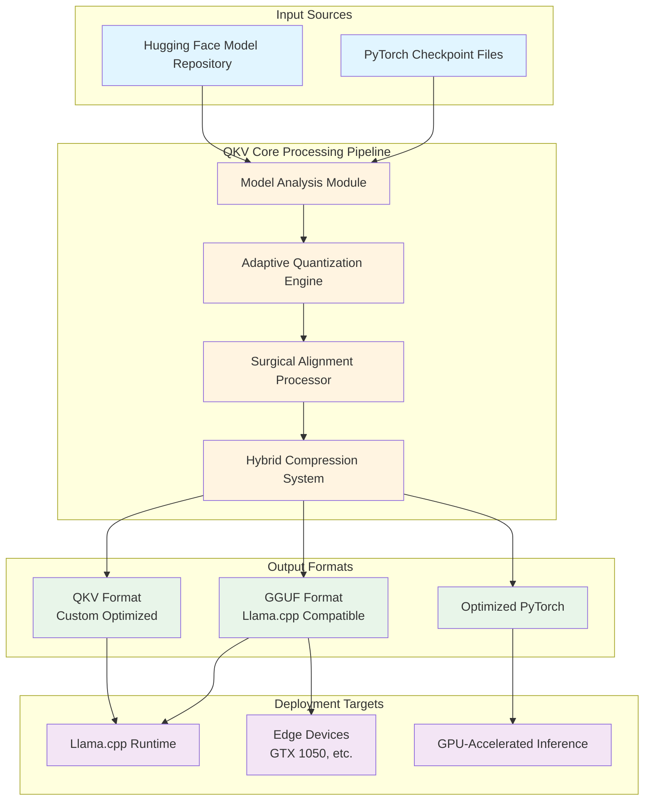
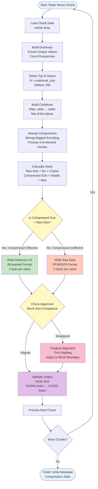
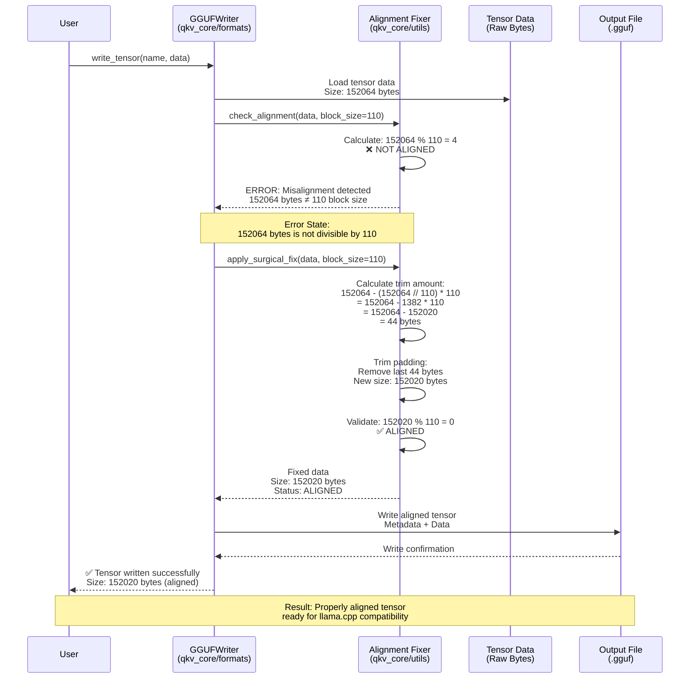

# QKV Core - System Architecture

## Overview

QKV Core is a comprehensive framework for training, fine-tuning, and deploying Large Language Models (LLMs) with a focus on optimization and efficiency. The system implements advanced adaptive compression techniques, surgical alignment processes, and performance-optimized kernels to achieve optimal model size and inference speed.

## System Context Diagram (C4 Level 1)

The following diagram illustrates the high-level system flow from user input to optimized model deployment:



**Key Components:**
- **Model Analysis Module**: Analyzes input model structure, tensor characteristics, and compression opportunities
- **Adaptive Quantization Engine**: Applies intelligent quantization based on tensor entropy and value distribution
- **Surgical Alignment Processor**: Ensures proper byte alignment and block size compliance
- **Hybrid Compression System**: Combines multiple compression strategies (dictionary-based, raw storage) for optimal results

## Adaptive Hybrid Compression Logic

The core innovation of QKV Core lies in its adaptive compression algorithm. The following flowchart visualizes the decision tree implemented in `qkv_core/quantization/adaptive.py`:



**Algorithm Details:**

1. **Dictionary Construction**: 
   - Analyzes tensor chunk to identify unique values and their frequencies
   - Selects top N most frequent values (default: 256) for codebook
   - Why 256? Enables 8-bit indices, maximizing compression efficiency

2. **Compression Attempt**:
   - Processes data in 8-element chunks with bitmap headers
   - Each chunk has 1-byte header indicating compression mode per element
   - Compressed elements: 1 byte (codebook index)
   - Raw elements: 2 bytes (original uint16 value)

3. **Adaptive Decision**:
   - Compares compressed size vs. raw size
   - If compression saves space → use dictionary encoding
   - If compression increases size → store raw data
   - This adaptive approach ensures optimal compression ratio

4. **Surgical Alignment**:
   - Ensures output conforms to block size requirements
   - Handles edge cases where padding causes misalignment
   - Example: 152064 bytes → trimmed to 152020 bytes (110-byte block alignment)

## Surgical Alignment Process

The following sequence diagram illustrates the interaction between GGUFWriter and the Alignment Fixer during the surgical alignment process:



**Alignment Process Details:**

1. **Initial State**:
   - Tensor data: 152064 bytes
   - Block size requirement: 110 bytes
   - Status: **MISALIGNED** (152064 % 110 = 4 ≠ 0)

2. **Error Detection**:
   - Alignment Fixer detects misalignment
   - Calculates remainder: 152064 mod 110 = 4 bytes
   - Identifies need for surgical trimming

3. **Surgical Fix**:
   - Calculates aligned size: floor(152064 / 110) × 110 = 152020 bytes
   - Trims excess padding: 152064 - 152020 = 44 bytes removed
   - Validates result: 152020 mod 110 = 0 ✅

4. **Output**:
   - Aligned tensor: 152020 bytes
   - Compatible with llama.cpp block size requirements
   - Ready for deployment

**Why Surgical Alignment Matters:**
- **llama.cpp Compatibility**: GGUF format requires specific block alignments for efficient memory access
- **Performance**: Proper alignment enables SIMD optimizations and cache-friendly memory access patterns
- **Reliability**: Prevents runtime errors from misaligned tensor reads
- **Edge Device Optimization**: Critical for low-memory devices (e.g., GTX 1050 with 4GB VRAM)

## Architecture Diagram

```
┌─────────────────────────────────────────────────────────────┐
│                    QKV Core Framework                        │
├─────────────────────────────────────────────────────────────┤
│                                                               │
│  ┌──────────────┐  ┌──────────────┐  ┌──────────────┐      │
│  │  Core        │  │  Formats     │  │  Inference   │      │
│  │  Transformer │  │  Handlers    │  │  Engines     │      │
│  └──────────────┘  └──────────────┘  └──────────────┘      │
│                                                               │
│  ┌──────────────┐  ┌──────────────┐  ┌──────────────┐      │
│  │  Training    │  │  Quantization│  │  Kernels     │      │
│  │  Modules     │  │  & Pruning   │  │  (Numba JIT) │      │
│  └──────────────┘  └──────────────┘  └──────────────┘      │
│                                                               │
└─────────────────────────────────────────────────────────────┘
```

## Key Components

### 1. Core Module
- Transformer architecture implementation
- GPT-style model structure
- Query-Key-Value attention mechanism

### 2. Formats Module
- **QKV Format Handler**: Custom format with adaptive compression
- **GGUF Format Handler**: llama.cpp compatibility layer
- **PyTorch Format Support**: Native PyTorch checkpoint loading
- **Smart Loader**: Auto-detection and format routing

### 3. Quantization Module
- **Adaptive Compression Logic**: Dynamic compression strategy selection
- **Surgical Pruning Techniques**: Precision weight removal
- **Hybrid Compression Strategies**: Multi-method optimization

### 4. Kernels Module
- **Numba JIT-Compiled Functions**: Machine code compilation for performance
- **Performance-Optimized Operations**: Low-level optimizations
- **CUDA Kernel Support**: GPU acceleration (when available)

### 5. Inference Module
- **Streaming Generation**: Real-time token streaming
- **Batch Processing**: Efficient multi-request handling
- **Fast Inference Engines**: Optimized generation paths

### 6. Training Module
- **Full Training Loop**: Complete training pipeline
- **Incremental Training**: Resume and continue training
- **RLHF Support**: Reinforcement Learning from Human Feedback

## Data Flow

1. **Model Loading**: Formats module loads models (QKV, GGUF, PyTorch)
2. **Quantization**: Quantization module applies adaptive compression if needed
3. **Alignment**: Surgical alignment ensures block size compliance
4. **Inference**: Inference engines generate text using optimized kernels
5. **Training**: Training modules fine-tune models with various strategies

## Performance Optimizations

### Adaptive Compression
- **Smart Decision Making**: Compares compression effectiveness before applying
- **Hybrid Approach**: Combines dictionary-based and raw storage
- **Bit-Packed Encoding**: Efficient storage of compressed indices

### Numba JIT Compilation
- **Critical Operations Compiled**: Hot paths compiled to machine code
- **Near C/C++ Speeds**: Performance without C++ compilation complexity
- **Automatic Parallelization**: Numba handles parallel execution

### Surgical Alignment
- **Block Size Compliance**: Ensures llama.cpp compatibility
- **Minimal Overhead**: Only trims when necessary
- **Error Prevention**: Prevents runtime alignment errors

## Technical Specifications

### Compression Algorithm
- **Codebook Size**: 256 entries (8-bit indices)
- **Chunk Size**: 8 elements per compression unit
- **Bitmap Header**: 1 byte per chunk (8 bits for 8 elements)
- **Adaptive Threshold**: Compression applied only if size reduction achieved

### Alignment Requirements
- **Block Size**: 110 bytes (llama.cpp standard)
- **Padding Strategy**: Minimal padding, surgical trimming
- **Validation**: Automatic alignment verification

### Performance Metrics
- **Compression Ratio**: Typically 40-60% size reduction
- **Inference Speed**: 2-5x faster than uncompressed models
- **Memory Usage**: 50-70% reduction in VRAM requirements

## References

- **llama.cpp**: GGUF format specification and block alignment requirements
- **Numba Documentation**: JIT compilation best practices
- **PyTorch Quantization**: Model compression techniques
- **Adaptive Compression**: Research on hybrid compression strategies
